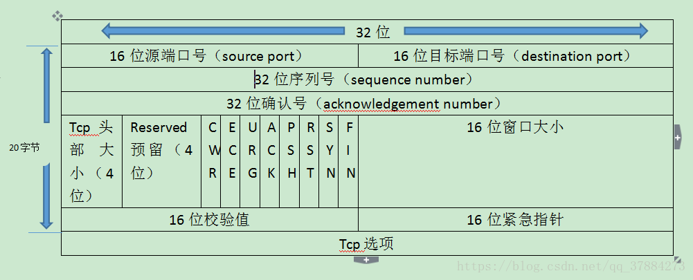

# 传输层

## TCP和UDP的区别

## TCP是如何保证可靠传输的?

- 流量控制
  接收方通过传动 rwnd 窗口值告知发送方

- 拥塞控制
  
  cwnd 窗口值
  算法有：慢开始-》拥塞避免-》快重传-》快恢复

  刚开始设置cwnd值为1，慢开始算法阈值为16
  
  swnd = min(rwnd,cwnd)

## TCP如何建立连接和释放连接？

TCP是一个面向连接的协议，无论哪一方向另一方发送数据之前，都必须先在双方之间建立一条连接，建立一条连接有以下过程。

1. 第一次握手：建立连接时，客户端发送 syn 包（syn=x）到服务器，并进入SYN_SENT状态，等待服务器确认；SYN：同步序列编号（Synchronize Sequence Numbers）。
2. 第二次握手：服务器收到 syn 包，必须确认客户的 SYN（ack=x+1），同时自己也发送一个 SYN 包（syn=y），即 SYN+ACK 包，此时服务器进入 SYN_RECV 状态；
3. 第三次握手：客户端收到服务器的 SYN + ACK 包，向服务器发送确认包 ACK(ack=y+1），此包发送完毕，客户端和服务器进入 ESTABLISHED（TCP连接成功）状态，完成三次握手。

这三个报文段完成连接的建立，这个过程成为三次握手。

- 三报文握手
  
  
- 四报文挥手
  

## TCP报文段的首部格式？

