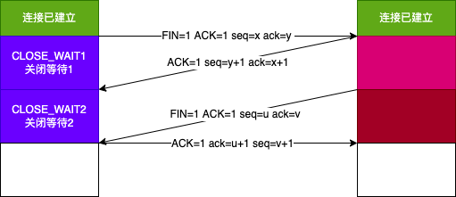

# 传输层

#### TCP和UDP的区别

#### TCP是如何保证可靠传输的?

- 流量控制
  接收方通过传动 rwnd 窗口值告知发送方

- 拥塞控制
  
  cwnd 窗口值
  算法有：慢开始-》拥塞避免-》快重传-》快恢复

  刚开始设置cwnd值为1，慢开始算法阈值为16
  

  swnd = min(rwnd,cwnd)

#### TCP如何建立连接和释放连接？

- 三报文握手
  
  
- 四报文挥手
  

#### TCP报文段的首部格式？

