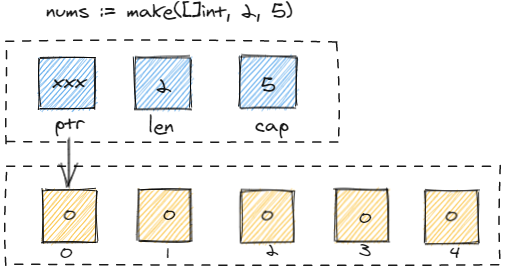
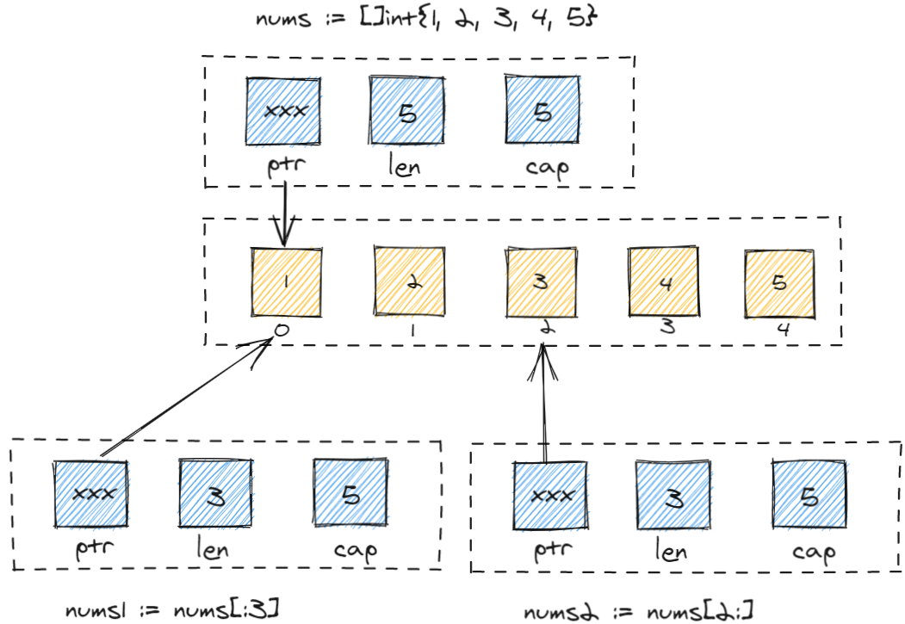

# interview questions

## 基础入门

### 基础数据类型

### 复合数据类型

#### array
数组是有固定长度的，不能动态扩容，在编译期间会确定，在声明时需要指定长度。
1. 声明
```go
var a [4]int
```
2. 初始化
```go
a := [4]int{1, 2, 3, 4}
b := [4]int{1, 3}
c := [4]int{1: 2, 3: 2}
d := [...]int{1, 3, 3, 3}
```
3. 其余操作
``` go
//数组比较：
//判断两个数组是否相等须符合下面两个条件：
//1、数组的类型相同。数组的类型由数组的长度和元素类型共同决定；
//2、数组内元素相等。
//数组拷贝：
//1、数组是值类型，也就是说在传递过程中会自动拷贝一份。
```
#### slice
切片使用起来类似长度可变的数组，长度是不固定的，但切片的底层使用的还是数组，切片只是保存了对数组的引用，帮着管理数组，实现可变的效果。
1. 声明
```go
var a []int
//切片未初始化则默认为 nil ，长度为 0 。
//如果清空切片可以赋值 nil ，例: nums = nil 。
```
2. 初始化
```go
//1、使用 make 函数初始化切片，容量参数可以省略，省略后长度和容量相等，格式：切片名称 := make([]数据类型，长度，容量)
aslice := make([]int, 10）
bslice := make([]int, 2, 5)
//2、初始化具体值
nums := []int{1, 2, 3} //初始化了一个长度为3的切片，此时容量也为3。
```
3. 内存结构

蓝色区域为切片的结构，它包含数组的指针（ptr）、切片长度（len）和切片容量（cap）。
1、ptr：数组指针，保存数组的内存地址，指向数组的具体索引。
2、len：切片的长度，可以使用 len(nums) 函数获取，表示从指针对应的索引位置开始所使用的长度。
3、cap：切片的容量，可以使用 cap(nums) 函数获取，表示引用数组的长度。

1. 其余项
1、定义了一个切片或数组后，可以获取其中的一部分，即子集。格式：切片或数组[开始索引:结束索引]
``` go
//切片
nums := []int{1, 2, 3, 4, 5}
//获取切片子集
nums1 := nums[2:4] //[]int{3, 4}
//数组
arr := [5]int{1, 2, 3, 4, 5}
//获取数组子集，获取后返回一个切片
nums2 := arr[2:4] //[]int{3, 4}
```


2、追加和移除元素
2.1、往切片中追加元素，使用到append()函数，此函数只能追加到切片末尾。
``` go
nums := []int{1, 2, 3}
nums = append(nums, 2)
nums = append(nums, 4, 5)//[1 2 3 2 4 5]
```
2.2、追加到开头
``` go
nums := []int{1, 2, 3}
// ... 三个点表示将切片元素展开传递给函数
nums = append([]int{4}, nums...) // [4,1,2,3]
```
2.3、移除某个元素
``` go
nums := []int{1, 2, 3, 4, 5}
// 移除索引为 2 的元素值
nums = append(nums[:2], nums[3:]...) // [1 2 4 5]
```

更多详细信息：https://mp.weixin.qq.com/s?__biz=MjM5MDUwNTQwMQ==&mid=2257483743&idx=1&sn=af5059b90933bef5a7c9d491509d56d9&scene=21#wechat_redirect

#### struct

#### map
