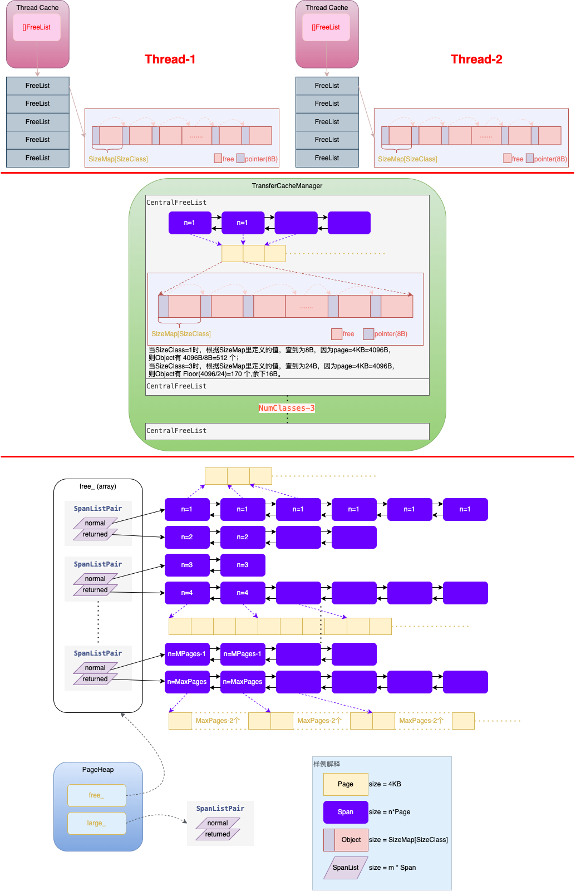

# TCMalloc

TCMalloc全程为Thread Cache Alloc，是Google开源的一个内存分配器，基于数据结构FreeList实现的。整个TCMalloc分为三层：

1. 第一层为线程缓存，也是TC开头的由来，每个线程有自己FreeList Array。
2. 第二层为中央缓存，也维护这一个FreeList Array，但实际叫CenterFreeList Array，实际是由TransferCacheManager维护的。中央缓存是所有线程共有的，如果线程需要访问中央缓存需要获取锁，访问完后需要释放锁。
3. 第三层为PageHeap，维护这SpanList Array。

## 名词解析

1. Page：操作系统是按Page管理内存的，本文中1Page为4KB；
2. Span：一个Span由n个Page构成，n为大于0的任何正整数，且构成这个Span的Page在虚拟内存空间上必须是连续的；
3. SpanList：具有相同Page个数的Span首位相连构成一个的双向链表；
4. Object：一个Span会按照某个大小（比如8B、16B、24B等）拆分为x个Object，同时这个x个Object通过指针构成一个单向链表行成FreeList；
5. SizeMap：自定义的一个map，保存了SizeClass和Span按多大Size来拆分成Object，比如 SizeClass=1，则按照8B的大小拆分Span行成FreeList。
