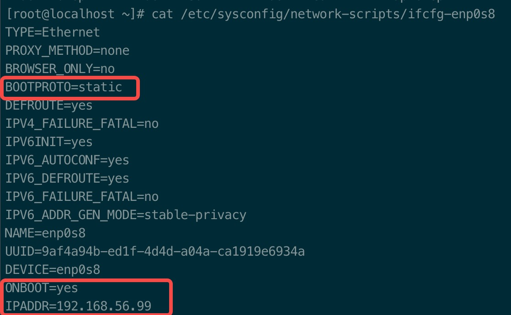

# virtualbox 安装 centos7

## 初始化一下参数

1. 更改网络设备为静态IP

2. 更改启动模式

    ``` bash
    #设置为图形界面模式
    $ systemctl set-default graphical.target 

    #设置为命令行模式
    $ systemctl set-default multi-user.target
    ```

3. 修改主机名

    ``` bash
    #设置主机名为origin
    $ hostnamectl set-hostname origin
    ```

4. 添加Host

    ``` bash
    #添加host
    $ vim /etc/hosts

    192.168.56.100 master
    192.168.56.101 node-1
    192.168.56.102 node-2
    192.168.56.99 origin
    
    ```

5. 设置sshd超时时间

    ``` bash
    # 更改如下两个参数的值
    # ClientAliveInterval 60
    # ClientAliveCountMax 3
    $ vim /etc/ssh/sshd_config
    ```
